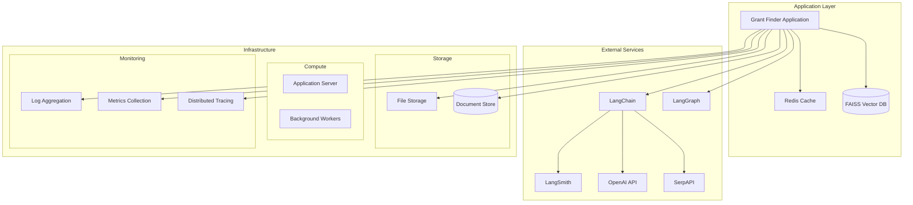

# Grant Finder

A sophisticated LangGraph-based AI system that helps organizations find, analyze, and strategically plan for grant opportunities by understanding company capabilities and matching them with relevant funding sources.

## Overview

Grant Finder uses an advanced multi-agent workflow powered by LangGraph to:
1. Analyze company documentation to understand capabilities and experience
2. Develop strategic search requirements
3. Search and analyze grant opportunities from multiple sources with retry mechanisms
4. Perform quality checks and gap analysis
5. Develop strategic pursuit plans
6. Generate comprehensive analysis reports

## System Architecture

### Service Architecture


### Infrastructure Requirements

1. **Compute Resources**
   - Application Server: 
     - CPU: 4+ cores
     - RAM: 16GB+
     - Storage: 100GB+ SSD
   - Workers:
     - CPU: 2+ cores per worker
     - RAM: 8GB+ per worker
     - Count: Based on concurrent searches

2. **Storage Resources**
   - Document Store: 100GB+ SSD
   - Vector DB: 50GB+ SSD
   - Cache: 10GB+ Memory
   - Logs: 50GB+ rotated storage

3. **Network Requirements**
   - Bandwidth: 100Mbps+
   - Low latency connections
   - Public endpoints for APIs
   - Internal service mesh

### External Service Dependencies

1. **OpenAI API**
   - Purpose: LLM operations
   - Requirements:
     - API key
     - Rate limits configuration
     - Error handling setup
     - Retry mechanisms

2. **SerpAPI**
   - Purpose: Web search operations
   - Requirements:
     - API key
     - Search quota management
     - Result parsing setup

3. **LangSmith (Optional)**
   - Purpose: Monitoring and debugging
   - Requirements:
     - API key
     - Project setup
     - Trace configuration

## Initial Setup

1. **System Prerequisites**
```bash
# Install system dependencies
sudo apt-get update && sudo apt-get install -y \
    python3.9 \
    python3.9-dev \
    python3-pip \
    git \
    redis-server \
    docker \
    docker-compose

# Install Poetry
curl -sSL https://install.python-poetry.org | python3 -
```

2. **Project Initialization**
```bash
# Clone repository
git clone https://github.com/yourusername/grant_finder
cd grant_finder

# Configure Poetry
poetry config virtualenvs.in-project true

# Install dependencies
poetry install

# Create necessary directories
poetry run python -c "
import os
from pathlib import Path

dirs = [
    'src/grant_finder/data/company_docs',
    'src/grant_finder/data/funding_sources',
    'logs',
    'output',
    'cache'
]

for d in dirs:
    Path(d).mkdir(parents=True, exist_ok=True)
"
```

3. **Configuration Setup**
```bash
# Copy example files
cp .env.example .env
cp config/user_config.yaml.example config/user_config.yaml

# Update .env with your API keys
vim .env

# Configure user settings
vim config/user_config.yaml
```

## Deployment

### Docker Deployment

1. **Build Image**
```bash
# Build using docker-compose
docker-compose build
```

2. **Configure Environment**
```bash
# Copy environment file
cp .env.example .env

# Edit environment variables
vim .env
```

3. **Run Services**
```bash
# Start all services
docker-compose up -d

# Scale workers if needed
docker-compose up -d --scale worker=3
```

### Manual Deployment

1. **Create Python Environment**
```bash
# Create virtual environment
poetry shell

# Install project
poetry install
```

2. **Configure Services**
```bash
# Start Redis
systemctl start redis

# Configure logging
mkdir -p /var/log/grant_finder
chown -R grant_finder:grant_finder /var/log/grant_finder
```

3. **Start Application**
```bash
# Run with Poetry
poetry run python -m grant_finder.main

# Or use systemd service
sudo systemctl start grant_finder
```

## Testing

### Test Categories

1. **Unit Tests**
```bash
# Run unit tests
pytest tests/unit/

# Test specific module
pytest tests/unit/test_nodes.py
```

2. **Integration Tests**
```bash
# Run integration tests
pytest tests/integration/

# Test with external services
pytest tests/integration/test_search.py
```

3. **System Tests**
```bash
# Run full system tests
pytest tests/system/

# Test specific workflow
pytest tests/system/test_workflow.py
```

### Test Coverage

```bash
# Generate coverage report
pytest --cov=grant_finder --cov-report=html

# View report
open htmlcov/index.html
```

### Performance Testing

```bash
# Run performance tests
pytest tests/performance/test_search_performance.py

# Profile code
python -m cProfile -o output.prof grant_finder/main.py
```

### Load Testing

```bash
# Install locust
poetry add locust

# Run load tests
locust -f tests/load/locustfile.py
```

## Monitoring

### Logging Setup

1. **Configure Logging**
```yaml
# logging_config.yaml
version: 1
formatters:
  standard:
    format: '%(asctime)s - %(name)s - %(levelname)s - %(message)s'
handlers:
  console:
    class: logging.StreamHandler
    formatter: standard
    stream: ext://sys.stdout
  file:
    class: logging.handlers.RotatingFileHandler
    formatter: standard
    filename: logs/grant_finder.log
    maxBytes: 10485760
    backupCount: 5
root:
  level: INFO
  handlers: [console, file]
```

2. **Metrics Collection**
```python
# Example metrics configuration
from prometheus_client import Counter, Histogram

SEARCH_REQUESTS = Counter(
    'grant_search_requests_total',
    'Total number of grant searches'
)

SEARCH_DURATION = Histogram(
    'grant_search_duration_seconds',
    'Time spent processing searches'
)
```

### Monitoring Dashboard

1. **Grafana Setup**
```yaml
# docker-compose.monitoring.yml
version: '3.8'
services:
  prometheus:
    image: prom/prometheus
    volumes:
      - ./prometheus.yml:/etc/prometheus/prometheus.yml
    ports:
      - "9090:9090"

  grafana:
    image: grafana/grafana
    ports:
      - "3000:3000"
    depends_on:
      - prometheus
```

2. **Dashboard Configuration**
```json
{
  "dashboard": {
    "panels": [
      {
        "title": "Search Success Rate",
        "type": "graph",
        "datasource": "Prometheus",
        "targets": [
          {
            "expr": "rate(grant_search_success_total[5m])"
          }
        ]
      }
    ]
  }
}
```

## Maintenance

### Backup Procedures

```bash
# Backup vector database
rsync -av /path/to/faiss/index /backup/location/

# Backup configuration
cp -r config/ /backup/location/

# Backup logs
tar czf backup_logs.tar.gz logs/
```

### Update Procedures

```bash
# Update dependencies
poetry update

# Apply migrations
poetry run python -m grant_finder.db.migrate

# Rebuild indexes
poetry run python -m grant_finder.tools.rebuild_index
```

## Troubleshooting Guide

### Common Issues

1. **Search Failures**
   - Check API rate limits
   - Verify network connectivity
   - Review error logs
   - Check source availability

2. **Performance Issues**
   - Monitor resource usage
   - Check cache hit rates
   - Review concurrent operations
   - Analyze query patterns

3. **Integration Issues**
   - Verify API credentials
   - Check service endpoints
   - Review network rules
   - Validate data formats

### Debug Tools

```bash
# Enable debug logging
export LOG_LEVEL=DEBUG

# Run with profiling
python -m cProfile grant_finder/main.py

# Check service status
systemctl status grant_finder
systemctl status redis

# View logs
tail -f logs/grant_finder.log
```

## Security

### API Security

1. **Authentication**
   - API key management
   - Token validation
   - Rate limiting
   - Access control

2. **Data Protection**
   - Encryption at rest
   - Secure transmission
   - Data sanitization
   - Access logging

### Configuration Security

```yaml
security:
  api_key_rotation: 30  # days
  rate_limit:
    requests: 100
    period: 3600  # seconds
  ssl:
    enabled: true
    cert_path: "/etc/ssl/certs/grant_finder.pem"
```

## License

MIT License

See 'LICENSE' for full text.