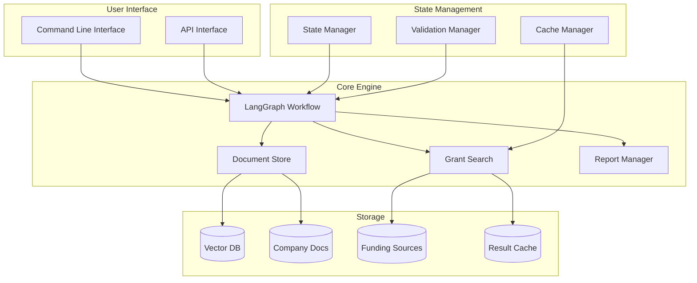
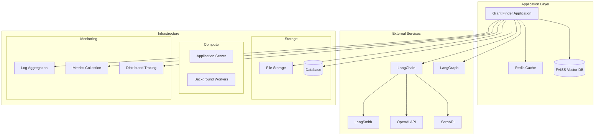
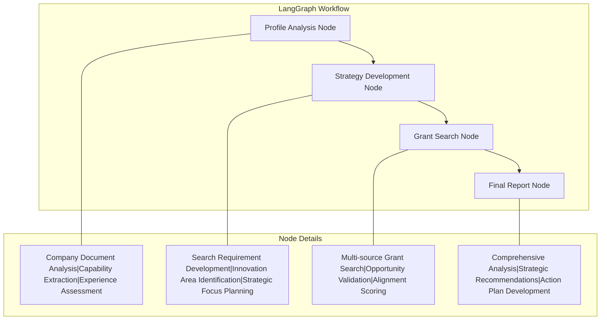

# Grant Finder

A LangGraph-based AI system that helps organizations find and analyze grant opportunities by understanding company capabilities and matching them with relevant funding sources.

## Overview

Grant Finder uses a sophisticated multi-agent workflow powered by LangGraph to:
1. Analyze company documentation to understand capabilities and experience
2. Develop strategic search requirements
3. Search and analyze grant opportunities from multiple sources
4. Generate comprehensive analysis reports

## Features

- Company profile analysis from documents
- Strategic requirements development
- Automated grant opportunity search
- Comprehensive grant analysis and reporting
- Multi-agent workflow using LangGraph
- Extensive logging and validation

## Architecture

### Solution Architecture


### System Architecture



### LangGraph Workflow


The LangGraph workflow consists of four main nodes that process information sequentially:

1. **Profile Analysis Node**
    - Analyzes company documents
    - Extracts capabilities and experience
    - Builds comprehensive company profile

2. **Strategy Development Node**
    - Develops search requirements
    - Identifies innovation areas
    - Plans strategic focus

3. **Grant Search Node**
    - Searches multiple funding sources
    - Validates opportunities
    - Scores alignment with requirements

4. **Final Report Node**
    - Analyzes opportunities
    - Generates recommendations
    - Develops action plans
 
Each node maintains its own state and passes processed information to the next node in the workflow.

#### Core Components
- **LangGraph Workflow Engine**: Orchestrates the multi-agent workflow
- **Document Store**: Manages document processing and retrieval
- **Grant Search Engine**: Handles multi-source opportunity discovery
- **State Manager**: Maintains workflow state and transitions

#### External Services
- **LangChain**: Framework for LLM interactions
- **LangGraph**: Graph-based workflow engine
- **LangSmith**: Monitoring and observability
- **OpenAI API**: Language model services
- **SerpAPI**: Web search integration

#### Infrastructure Requirements

1. **Compute Resources**:
   - Application Server: 4+ CPUs, 16GB+ RAM
   - Workers: 2+ CPUs, 8GB+ RAM per worker
   - GPU (Optional): For local embeddings

2. **Storage**:
   - Document Store: 100GB+ SSD
   - Vector DB: 50GB+ SSD
   - Cache: 10GB+ Memory

3. **External Service Dependencies**:
   - OpenAI API account
   - SerpAPI key
   - LangSmith account (optional)

## Initial Setup

1. Install Poetry (if not already installed):
```bash
curl -sSL https://install.python-poetry.org | python3 -
```

2. Clone and initialize the project:
```bash
# Clone repository
git clone https://github.com/yourusername/grant_finder
cd grant_finder

# Install dependencies with Poetry
poetry install

# Create necessary directories and config files
poetry run python -c "
import os
from pathlib import Path

# Create directories
dirs = [
    'src/grant_finder/data/company_docs',
    'src/grant_finder/data/funding_sources',
    'logs',
    'output'
]
for d in dirs:
    Path(d).mkdir(parents=True, exist_ok=True)

# Copy example files if they don't exist
examples = {
    '.env.example': '.env',
    'src/grant_finder/config/user_config.yaml.example': 'src/grant_finder/config/user_config.yaml',
    'src/grant_finder/data/funding_sources/sources.csv.example': 'src/grant_finder/data/funding_sources/sources.csv'
}
for src, dst in examples.items():
    if not Path(dst).exists() and Path(src).exists():
        Path(dst).write_text(Path(src).read_text())
"
```

## Configuration

1. Configure your environment:
```bash
# Edit .env with your API keys
vim .env

# Edit configuration
vim src/grant_finder/config/user_config.yaml

# Edit funding sources
vim src/grant_finder/data/funding_sources/sources.csv
```

## Usage

### Basic Usage
```python
from grant_finder.main import main

if __name__ == "__main__":
    main()
```

### Custom Search
```python
from grant_finder import run_grant_search

results = run_grant_search(
    company_focus="AI and Machine Learning",
    organization_focus="DoD",
    company_context_path="path/to/docs",
    funding_sources_path="path/to/sources.csv",
    output_dir="path/to/output"
)
```

## Development

### Local Development
```bash
# Activate virtual environment
poetry shell

# Run tests
poetry run pytest

# Run the application
poetry run python -m grant_finder.main

# Install development dependencies
pip install -e ".[dev]"
```

### Docker Development

1. Build and run with Docker Compose:
```bash
# Build the container
docker-compose build

# Run the container
docker-compose up

# Run in background
docker-compose up -d
```

2. Execute commands in container:
```bash
# Run tests in container
docker-compose run grant_finder poetry run pytest

# Run application in container
docker-compose run grant_finder poetry run python -m grant_finder.main

# Open shell in container
docker-compose run grant_finder /bin/bash
```

### Development Tools
```bash
# Format code
poetry run black .

# Sort imports
poetry run isort .

# Run linter
poetry run ruff check .

# Run all quality checks
poetry run pre-commit run --all-files
```

## Testing

The project uses pytest for automated testing. Here are the key testing commands:

### Basic Testing
```bash
# Run all tests
pytest

# Run with verbose output (-v)
pytest -v

# Show print statements (-s)
pytest -s

# Run specific test file
pytest tests/test_main.py

# Run specific test function
pytest tests/test_main.py::test_successful_execution
```

### Advanced Testing Options
```bash
# Generate coverage report
pytest --cov=grant_finder

# Detailed coverage report
pytest --cov=grant_finder --cov-report=html

# Stop on first failure
pytest -x

# Show locals in tracebacks
pytest --showlocals

# Run marked tests
pytest -m slow  # Runs tests marked with @pytest.mark.slow
```

### Test Categories
- Unit Tests: `pytest tests/test_types.py`
- Integration Tests: `pytest tests/test_main.py`
- Tool Tests: `pytest tests/test_tools.py`
- Node Tests: `pytest tests/test_nodes.py`

### Testing During Development
```bash
# Run tests with auto-reload
pytest-watch

# Run tests with specific markers
pytest -v -m "not slow"
```

## Example Usage

See the `examples/` directory for:
- Basic search implementation
- Custom tool integration
- Advanced configuration

## Troubleshooting

If tests fail:
1. Check environment variables are set
2. Verify configuration files exist
3. Review test logs in `logs/`
4. Run tests with `-v` flag for detailed output
5. Use `--pdb` flag to debug failing tests

## License

MIT License