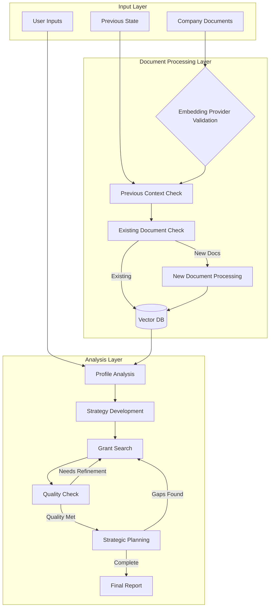
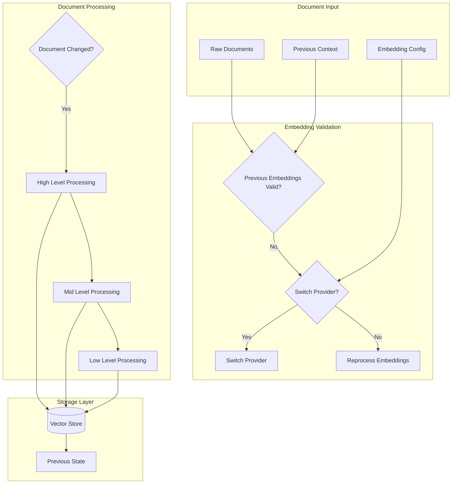

# Grant Finder

A sophisticated LangGraph-based AI system that helps organizations find, analyze, and strategically plan for grant opportunities by understanding company capabilities and matching them with relevant funding sources.

## Table of Contents

1. [Overview](#overview)
2. [Architecture](#architecture)
   - [Solution Architecture](#solution-architecture)
   - [System Architecture](#system-architecture)
   - [LangGraph Workflow](#langgraph-workflow)
   - [Technical Solution Flow](#technical-solution-flow)
3. [Features](#features)
4. [Components](#components)
5. [Workflow Process](#workflow-process)
6. [Installation](#installation)
7. [Configuration](#configuration)
8. [Usage](#usage)
9. [Development](#development)
10. [Testing](#testing)
11. [Deployment](#deployment)
12. [Monitoring](#monitoring)
13. [Maintenance](#maintenance)
14. [Security](#security)
15. [Troubleshooting](#troubleshooting)
16. [License](#license)

## Overview

Grant Finder uses a sophisticated multi-agent workflow powered by LangGraph to:
1. Analyze company documentation to understand capabilities and experience
2. Develop strategic search requirements
3. Search and analyze grant opportunities from multiple sources with retry mechanisms
4. Perform quality checks and gap analysis
5. Develop strategic pursuit plans
6. Generate comprehensive analysis reports

## Architecture

### Solution Architecture


### System Architecture


### LangGraph Workflow


### Technical Solution Flow

#### System Flow Overview


#### Document Processing Flow


## Step-by-Step Process Flow

### 1. Initialization Phase
- **Configuration Loading**
  - Load user configuration from `user_config.yaml`
  - Validate required paths and configurations
  - Initialize logging system

- **State Management Setup**
  - Create session ID using timestamp
  - Initialize GrantFinderState
  - Load previous context if available

- **Document Store Initialization**
  ```python
  HierarchicalDocumentStore(
      base_path=Path,
      config=Dict,
      previous_context=Optional[Dict]
  )
  ```

### 2. Document Processing Phase
- **Embedding Provider Validation**
  1. Check previous embedding provider
  2. Compare with current configuration
  3. Decision tree:
     - If match: Continue with existing embeddings
     - If mismatch: Prompt for reprocess or switch
     - If new: Initialize fresh embeddings

- **Document Processing Flow**
  1. High-level Processing (chunk_size=3000)
     ```python
     {
         "summary": str,
         "context": Dict[str, Any],
         "metadata": Dict[str, Any]
     }
     ```
  2. Mid-level Processing (chunk_size=1500)
     ```python
     {
         "details": List[Dict],
         "connections": List[str],
         "metadata": Dict[str, Any]
     }
     ```
  3. Low-level Processing (chunk_size=500)
     ```python
     {
         "specifics": List[Dict],
         "references": List[str],
         "metadata": Dict[str, Any]
     }
     ```

### 3. Analysis Workflow Phase

#### Profile Analysis Node
1. Input Processing
   - Company documents
   - User focus areas
   - Configuration context

2. Hierarchical Analysis
   ```python
   {
       "high_level": {
           "summary": List[Dict],
           "context": Dict
       },
       "mid_level": {
           "details": List[Dict],
           "context": Dict
       },
       "low_level": {
           "specifics": List[Dict]
       }
   }
   ```

#### Strategy Development Node
1. Requirements Analysis
   ```python
   {
       "technical_requirements": List[str],
       "innovation_areas": List[Dict],
       "competitive_advantages": List[Dict],
       "target_phases": List[Dict]
   }
   ```

2. Cross-reference Development
   ```python
   {
       "capability_links": List[str],
       "innovation_connections": List[str],
       "experience_references": List[str]
   }
   ```

#### Grant Search Node
1. Source Processing
   ```python
   for source in funding_sources:
       search_with_backoff(
           max_retries=3,
           exponential_delay=True
       )
   ```

2. Validation Pipeline
   ```python
   {
       "topic_id": str,
       "technical_requirements": List[str],
       "alignment_score": float,
       "deadline": datetime,
       "award_amount": str
   }
   ```

#### Quality Check Node
1. Coverage Analysis
   ```python
   {
       "technical_coverage": float,
       "timeline_feasibility": bool,
       "resource_alignment": float
   }
   ```

2. Gap Identification
   ```python
   {
       "technical_gaps": List[str],
       "timeline_gaps": List[str],
       "resource_gaps": List[str]
   }
   ```

#### Strategic Planning Node
1. Action Planning
   ```python
   {
       "immediate_actions": List[Dict],
       "thirty_day_actions": List[Dict],
       "sixty_day_actions": List[Dict],
       "ninety_day_actions": List[Dict]
   }
   ```

2. Resource Allocation
   ```python
   {
       "proposal_schedule": List[Dict],
       "event_schedule": List[Dict],
       "partnership_strategy": List[Dict]
   }
   ```

### 4. State Management

#### Persistence Layer
- Vector Store: FAISS with hierarchical indexes
- Context Storage: JSON with provider metadata
- Session Management: SQLite with state tracking

#### Error Handling
1. Retry Mechanisms
   - Exponential backoff
   - Maximum retry limits
   - Error categorization

2. State Recovery
   - Checkpoint creation
   - State restoration
   - Context preservation

## Implementation Notes

### Embedding Configuration
```yaml
embeddings:
  provider: "openai"  # or "gptj"
  save_path: "path/to/embeddings"
  openai:
    model: "text-embedding-3-small"
    dimension: 1536
  gptj:
    model_path: "path/to/model"
    dimension: 4096
```

### Document Processing Parameters
```yaml
chunk_sizes:
  high_level: 3000
  mid_level: 1500
  low_level: 500
overlap_ratio: 0.1
batch_size: 50
```

### System Requirements
- Memory: Minimum 16GB RAM
- Storage: 100GB+ SSD recommended
- Python: 3.9+
- Dependencies: See pyproject.toml

### Performance Considerations
- Batch processing for large document sets
- Caching for frequently accessed embeddings
- Concurrent processing where applicable
- Resource cleanup after major operations

### Infrastructure Requirements

1. **Compute Resources**
   - Application Server:
     - CPU: 4+ cores
     - RAM: 16GB+
     - Storage: 100GB+ SSD
   - Workers:
     - CPU: 2+ cores per worker
     - RAM: 8GB+ per worker
     - Count: Based on concurrent searches

2. **Storage Resources**
   - Document Store: 100GB+ SSD
   - Vector DB: 50GB+ SSD
   - Cache: 10GB+ Memory
   - Logs: 50GB+ rotated storage

3. **Network Requirements**
   - Bandwidth: 100Mbps+
   - Low latency connections
   - Public endpoints for APIs
   - Internal service mesh

4. **External Service Dependencies**
   - OpenAI API account
   - SerpAPI key
   - LangSmith account (optional)

## Features

- **Intelligent Document Analysis**
  - Company profile extraction
  - Capability mapping
  - Experience assessment
  - Semantic search

- **Strategic Planning**
  - Requirements development
  - Gap analysis
  - Action planning
  - Timeline development

- **Robust Grant Search**
  - Multi-source search
  - Retry mechanism
  - Validation
  - Result ranking

- **Quality Assurance**
  - Coverage analysis
  - Gap identification
  - Search refinement
  - Result validation

- **Comprehensive Reporting**
  - Analysis reports
  - Strategic recommendations
  - Action plans
  - Success metrics

## Components

### Agents

1. **Company Profiler Agent**
   ```yaml
   name: Company_Profiler
   role: Expert Company Document Analyzer
   goal: Perform comprehensive semantic analysis
   backstory: Expert at analyzing company documents
   functions:
     - Semantic analysis
     - Capability extraction
     - Experience assessment
   ```

2. **Strategic Writer Agent**
   ```yaml
   name: Strategic_Writer
   role: Strategic Content Developer
   goal: Develop compelling strategic narratives
   backstory: Experienced technical writer
   functions:
     - Requirements development
     - Value proposition creation
     - Alignment analysis
   ```

3. **Federal Grant Search Agent**
   ```yaml
   name: Federal_Grant_Researcher
   role: Federal Grant Search Specialist
   goal: Search and validate opportunities
   backstory: Expert in federal databases
   functions:
     - Multi-source search
     - Opportunity validation
     - Source tracking
   ```

4. **Quality Check Agent**
   ```yaml
   name: Quality_Check_Specialist
   role: Search Result Quality Analyst
   goal: Ensure comprehensive results
   backstory: Expert in quality analysis
   functions:
     - Coverage analysis
     - Gap identification
     - Refinement recommendations
   ```

5. **Strategic Planning Agent**
   ```yaml
   name: Strategic_Planning_Specialist
   role: Planning and Execution Expert
   goal: Develop comprehensive plans
   backstory: Expert strategist
   functions:
     - Action planning
     - Timeline development
     - Resource allocation
   ```

### Tools

1. **CompanyDocumentTool**
   ```python
   class CompanyDocumentTool:
       """Tool for company document analysis"""
       functions:
           - document_indexing()
           - semantic_search()
           - extract_capabilities()
   ```

2. **EnhancedGrantSearchTool**
   ```python
   class EnhancedGrantSearchTool:
       """Tool for comprehensive grant searching"""
       functions:
           - search_multiple_sources()
           - validate_opportunities()
           - track_results()
   ```

3. **StrategicPlannerTool**
   ```python
   class StrategicPlannerTool:
       """Tool for strategic planning"""
       functions:
           - develop_timeline()
           - create_action_plan()
           - allocate_resources()
   ```

### State Management

```python
class GrantFinderState:
    """Main state management class"""
    
    # Core state
    company_profile: CompanyProfileState
    search_requirements: SearchRequirementsState
    grant_opportunities: List[GrantOpportunityState]
    
    # Progress tracking
    search_progress: Dict[str, Dict]
    search_iterations: int
    
    # Quality management
    validation_results: Dict[str, List[str]]
    identified_gaps: List[Dict[str, str]]
    
    # Planning
    strategic_plan: Dict[str, Any]
    planned_actions: List[Dict[str, Any]]
```

## Installation

1. **System Prerequisites**
```bash
# Install system dependencies
sudo apt-get update && sudo apt-get install -y \
    python3.9 \
    python3.9-dev \
    python3-pip \
    git \
    redis-server \
    docker \
    docker-compose

# Install Poetry
curl -sSL https://install.python-poetry.org | python3 -
```

2. **Project Setup**
```bash
# Clone repository
git clone https://github.com/yourusername/grant_finder
cd grant_finder

# Configure Poetry
poetry config virtualenvs.in-project true

# Install dependencies
poetry install

# Create directories
mkdir -p {logs,output,cache,data/{company_docs,funding_sources}}
```

3. **Configuration**
```bash
# Copy example configs
cp .env.example .env
cp config/user_config.yaml.example config/user_config.yaml

# Edit configurations
vim .env
vim config/user_config.yaml
```

## Configuration

### User Configuration
```yaml
company_context:
  directory: "path/to/company_docs"

funding_sources:
  file_path: "path/to/sources.csv"

model:
  name: "gpt-3.5-turbo-0125"
  temperature: 0.0
  request_timeout: 180
  max_tokens: 500
  max_retries: 3

output:
  format: "markdown"
  save_to_file: true
  output_directory: "path/to/output"
```

### Logging Configuration
```yaml
version: 1
formatters:
  standard:
    format: '%(asctime)s - %(name)s - %(levelname)s - %(message)s'
handlers:
  console:
    class: logging.StreamHandler
    formatter: standard
    stream: ext://sys.stdout
  file:
    class: logging.handlers.RotatingFileHandler
    formatter: standard
    filename: logs/grant_finder.log
    maxBytes: 10485760
    backupCount: 5
root:
  level: INFO
  handlers: [console, file]
```

## Usage

### Basic Usage
```python
from grant_finder.main import main

if __name__ == "__main__":
    main()
```

### Custom Search
```python
from grant_finder import run_grant_search

results = run_grant_search(
    company_focus="AI and Machine Learning",
    organization_focus="DoD",
    company_context_path="path/to/docs",
    funding_sources_path="path/to/sources.csv",
    output_dir="path/to/output"
)
```

## Development

### Setup Development Environment
```bash
# Create virtual environment
poetry shell

# Install dev dependencies
poetry install --with dev

# Setup pre-commit hooks
pre-commit install
```

### Code Style
```bash
# Format code
poetry run black .
poetry run isort .

# Lint code
poetry run ruff .

# Type checking
poetry run mypy .
```

## Testing

### Test Categories

1. **Unit Tests**
```bash
# Run unit tests
pytest tests/unit/

# With coverage
pytest tests/unit/ --cov=grant_finder
```

2. **Integration Tests**
```bash
# Run integration tests
pytest tests/integration/

# Specific test
pytest tests/integration/test_search.py
```

3. **System Tests**
```bash
# Run system tests
pytest tests/system/

# With debug logs
pytest tests/system/ -v --log-cli-level=DEBUG
```

### Performance Testing
```bash
# Run performance tests
pytest tests/performance/

# Profile execution
python -m cProfile -o output.prof scripts/profile_search.py
```

## Deployment

### Docker Deployment

1. **Build Image**
```bash
docker-compose build
```

2. **Run Services**
```bash
# Start all services
docker-compose up -d

# Scale workers
docker-compose up -d --scale worker=3
```

### Manual Deployment

1. **System Setup**
```bash
# Create service user
sudo useradd -r -s /bin/false grant_finder

# Setup directories
sudo mkdir -p /opt/grant_finder
sudo chown grant_finder:grant_finder /opt/grant_finder
```

2. **Application Setup**
```bash
# Copy files
sudo cp -r . /opt/grant_finder/
cd /opt/grant_finder

# Install dependencies
poetry install --no-dev
```

3. **Service Setup**
```bash
# Create systemd service
sudo vim /etc/systemd/system/grant_finder.service

# Start service
sudo systemctl enable grant_finder
sudo systemctl start grant_finder
```

## Monitoring

### Logging Setup
```python
import logging
from logging.handlers import RotatingFileHandler

logger = logging.getLogger('grant_finder')
handler = RotatingFileHandler(
    'logs/grant_finder.log',
    maxBytes=10_000_000,
    backupCount=5
)
logger.addHandler(handler)
```

### Metrics Collection
```python
from prometheus_client import Counter, Histogram

SEARCH_REQUESTS = Counter(
    'grant_search_requests_total',
    'Total number of grant searches'
)

SEARCH_DURATION = Histogram(
    'grant_search_duration_seconds',
    'Time spent processing searches'
)
```

### Monitoring Dashboard
```yaml
# docker-compose.monitoring.yml
version: '3.8'
services:
  prometheus:
    image: prom/prometheus
    volumes:
      - ./prometheus.yml:/etc/prometheus/prometheus.yml
  
  grafana:
    image: grafana/grafana
    depends_on:
      - prometheus
```

## Maintenance

### Backup Procedures
```bash
# Backup vector database
rsync -av /path/to/faiss/index /backup/location/

# Backup configuration
cp -r config/ /backup/location/

# Backup logs
tar czf logs_backup.tar.gz logs/
```

### Update Procedures
```bash
# Update dependencies
poetry update

# Apply migrations
poetry run python -m grant_finder.db.migrate

# Rebuild indexes
poetry run python -m grant_finder.tools.rebuild_index
```

## Security

### API Security
```yaml
security:
  api_key_rotation: 30  # days
  rate_limit:
    requests: 100
    period: 3600
  ssl:
    enabled: true
    cert_path: "/etc/ssl/certs/grant_finder.pem"
```

### Data Protection
1. **Encryption**
   - Data at rest encryption
   - TLS for data in transit
   - API key encryption

2. **Access Control**
   - Role-based access
   - IP whitelisting
   - Request signing

## Troubleshooting

### Common Issues

1. **Search Failures**
   - Check API keys